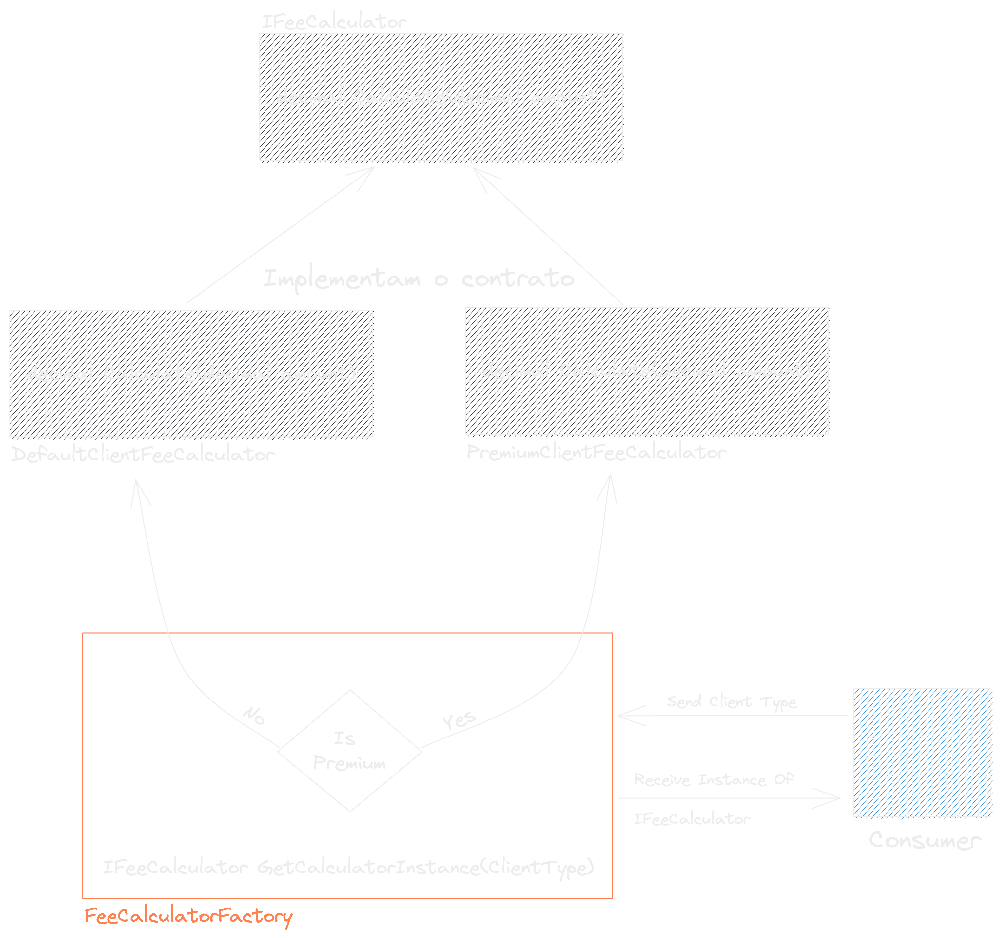
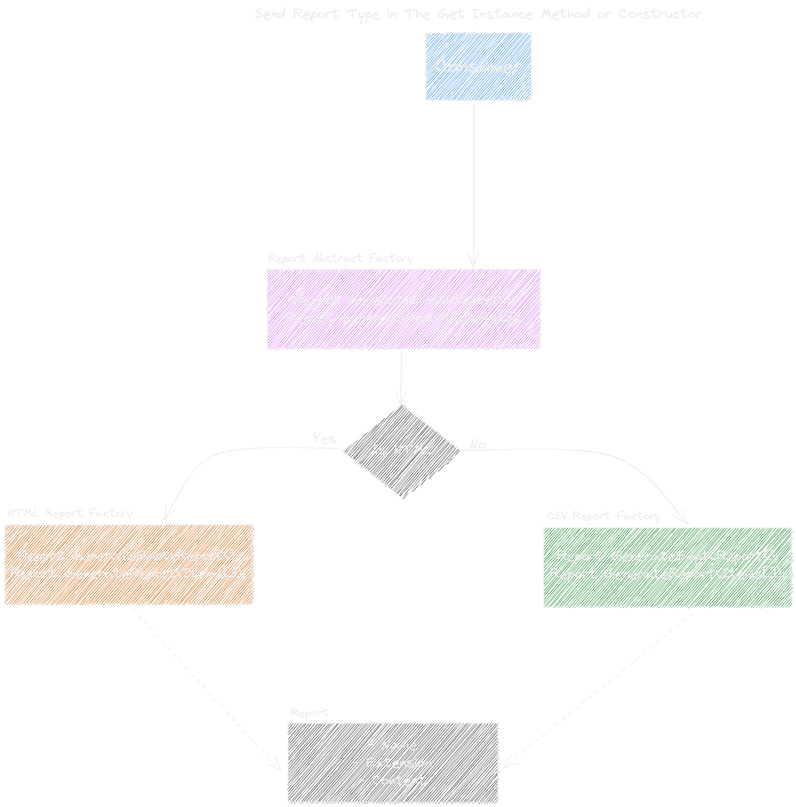
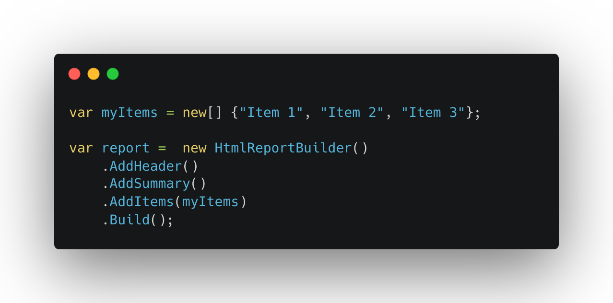

# Design Patterns

Design Patterns são padrões, formas de resolver problemas comuns da programação, independente de linguagem, mas em alguns casos mais focados no paradigma de OOP. Um dos seus grandes benefícios é ter uma forma comum e pronta de resolver um problema específico, isso facilita muito a comunicação e ambientação de outras pessoas na equipe.

</img>

Quando se fala de Design Patterns não podemos deixar de falar sobre o GOF(Gang Of Four), basicamente foram os responsáveis por organizar em um livro os principais desogn patterns usados na época(e ainda são muito usados), certamente vocÊe já viu esse livro circulando por ai, nele você vai encontrar 23 padrões de projetos, mas, na prática existem muitos outros que não estão lá.

## Classificação

Podemos dividir os Design Patterns em três conjuntos: Criacionais, Estruturais e Comportamentais.

</img>

## Criacionais

A grande ideia aqui é abstrair e facilitar o processo de criação de objetos, a criação de uma nova instância, abstraindo e facilitando o processo de instanciar objetos complexos. E o mais legal é que essa categoria de padrões pode trabalhar com configuração statica(hard coded), ou configurações dinâmicas, buscando dados para se configurar em um banco, um arquivo...

Importante, cada vez menos você vai ver essa categoria, pois em sua grande parte está sendo subsititúida por containers de injeção de dependência.

[Exemplos de código 🗂️](./1-Criasionais/)

### Singleton

Vamos iniciar com um dos mais controversos, ele pode nos dar muitas dores de cabeça para situações onde nosso código roda em mais de uma thread, e também em casos de testes de unidade, pois acaba sendo muito difícil de colocar um duble de teste em seu lugar.

Na prática, a sua ideia é garantir que exista apenas uma instância do objeto em toda sua aplicação. É muito prático em situações onde todos os usuários de uma classe precisam usar das mesmas informações.

### Factory Method

Esse é um padrão muito usado para a abstrair o processo de instanciar um conjunto de classes que implementam o mesmo contrato. Ná pratica, você tem uma fábrica que recebe parâmetros e sempre retorna uma instância de uma class que implementa o contrato.

Vamos para o nosso exemplo, onde dependendo da regra que o usuário possúi, as taxas que ele vai pagar pode mudar. A gente tem a opção em tudo que é lugar pegar a config desse usuário e instanciar a classe com as suas regras, ou a gente pode centralizar isso em uma fábrica que retorna classes que sabem fazer esse cálculo conforme com a regra passada.

### Abstract Factory

Já entendemos o que é uma fábrica quando falamos do Factory Method, e o Abstract Factory também não está foge muito da disso, a ideia é ser uma fábrica não apenas de um tipo de classe, mas sim de um conjunto; Em muitos lugares você pode ler algo falando que é uma fábrica de fábricas, isso não está 100% errado, mas, na prática, ela não se restringe conceitualmente somente a isso.

Vamos para o nosso exemplo de um sistema de relatórios de compras feitas, que hoje temos dois tipos, a geração dos relatórios HTML e em CSV, são os mesmos dados de entrada, mas o que muda é como eles são apresentados, e importante, temos apenas duas regras que se aplicam independente do tipo do arquivo, quando não informações na lista de compras, o relatório vai ter informações diferentes; Na prática, teremos um factory para o tipo CSV, um factory para o tipo HTML, e um factory que vai fazer o uso dos dois anteriores, que vai ser o nosso abstract factory, da uma olhada no desenho.

### Builder

Esse é um dos mais legais quando se fala de criacionais. Seu papel é facilitar a criação de objetos complexos de forma dinâmica, sem obrigatoriamente passar tudo de uma vez só no construtor.

Um exemplo bem legal que a gente continuar no exemplo de relatório, é um gerador de relatório HTML de forma dinâmica usando código, onde dependendo dos dados, você monta de uma forma ou de outra.

Pensando no nosso exemplo, teríamos uma classe de reportBuilder, que você vai chamando os métodos, como o de Adiciar o header, Adicionar summary, adiciona transaçoes, adicionar quebra de linha... e depois de tudo configurado você vai chamar o método de build, que vai pegar tudo que você colocou em ordem, validar, e se estiver tudo correto vai retornar o nosso report!

### Prototype

---

## Estruturais

[Exemplos de código 🗂️](./2-Estruturais/)

## Comportamentais

[Exemplos de código 🗂️](./3-Comportamentais/)
